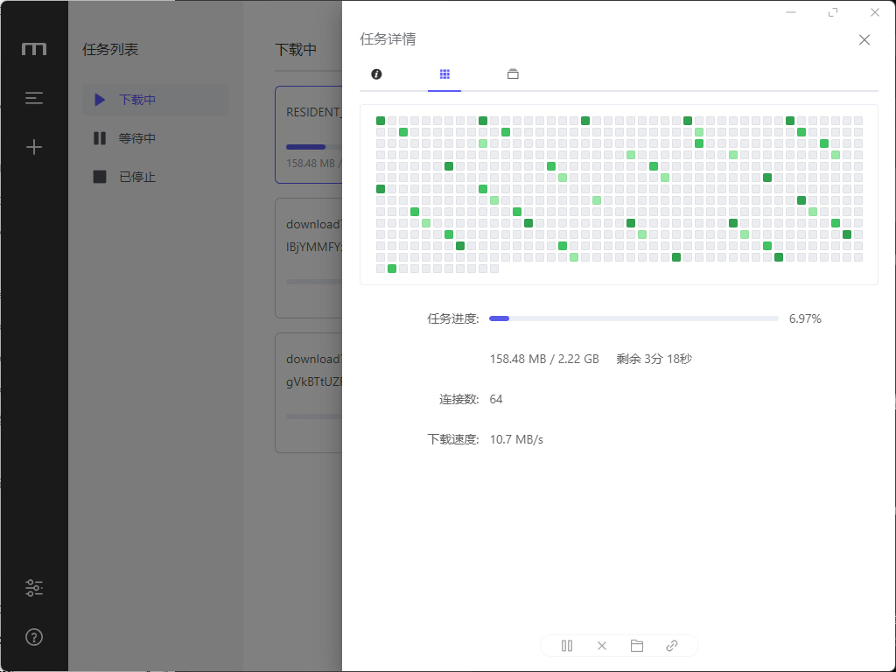

# 说明
使用客户端API的城通网盘下载器
- 基于Cloudflare Workers
- 比网页端下载速度快一点点
- 绕过城通网盘线程限制

如果帮到了你，能否给我一个star呢？

# DEMO
面板 <https://umpsa.top>

API <https://api.umpsa.top>

测试图片 

# 接口列表（精简版）

| 接口            | 方法 | 参数                                  | 描述                                   |
| --------------- | ---- | ------------------------------------- | -------------------------------------- |
| `/meow`         | GET  | 无                                    | `Meow`                  |
| `/login`         | GET  | `password?`                          | 验证密码是否正确，返回 `true` 或 `false`（env.PASSWORD 为空时始终为 true） |
| `/download_info` | GET  | `xtlink`, `token?`, `password?`       | 获取文件列表，返回 `[ { key, name } ]` |
| `/download`     | GET  | `xtlink`, `token?`, `password?`, `file_id` | 下载文件，`file_id` 来自 `/download_info` 返回的 key 的值 |

# 配置
（可选，但建议）环境变量配置 env.PASSWORD,没有则不做鉴权

修改 token.ts 中的 TOKENS 变量，填入你的 TOKEN（cookie中的ct_uid），每个TOKEN为一个线程（以快速使用）

# 前端面板
- 仓库地址：<https://github.com/Nekohy/ctfile-downloader-panel> （由v0.dev自动生成）

(使用时配置NEXT_PUBLIC_API_URL为你自己的API地址)

# 免责声明
本项目仅供学习交流使用，无任何盈利/售卖行为，请勿用于非法用途，否则后果自负